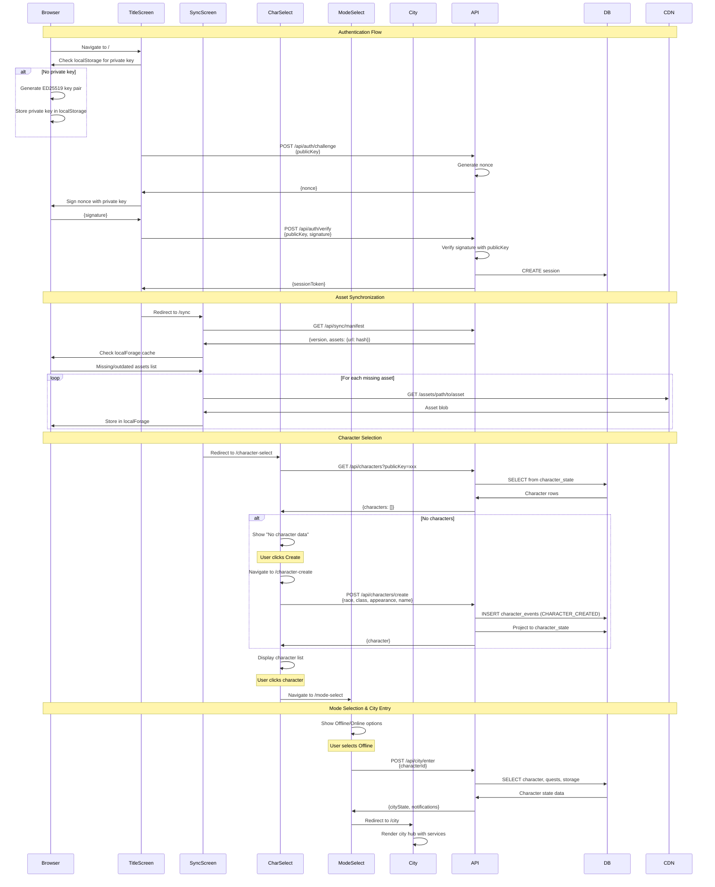

This sequence diagram shows the detailed chronological flow of data from the initial page load through entering the city hub.

## Diagram



## Sequence Breakdown

### Phase 1: Authentication (Title Screen)

**1. Initial Page Load**:
```
Browser → TitleScreen: Navigate to /
TitleScreen → Browser: Check localStorage
```

**2. Key Management**:
```
alt: No private key
  Browser → Browser: Generate ED25519 key pair
  Browser → Browser: Store in localStorage
```

**3. Challenge Request**:
```
TitleScreen → API: POST /api/auth/challenge {publicKey}
API → API: Generate random nonce
API → TitleScreen: {nonce}
```

**4. Signature Generation**:
```
TitleScreen → Browser: Sign nonce with private key
Browser → TitleScreen: {signature}
```

**5. Verification**:
```
TitleScreen → API: POST /api/auth/verify {publicKey, signature}
API → API: Verify signature
API → DB: CREATE session
API → TitleScreen: {sessionToken}
```

### Phase 2: Asset Synchronization (Sync Screen)

**1. Navigation**:
```
TitleScreen → SyncScreen: Redirect to /sync
```

**2. Manifest Fetch**:
```
SyncScreen → API: GET /api/sync/manifest
API → SyncScreen: {version, assets: {url: hash}}
```

**3. Cache Check**:
```
SyncScreen → Browser: Check localForage cache
Browser → SyncScreen: Missing/outdated assets list
```

**4. Asset Download Loop**:
```
loop: For each missing asset
  SyncScreen → CDN: GET /assets/path/to/asset
  CDN → SyncScreen: Asset blob
  SyncScreen → Browser: Store in localForage
```

### Phase 3: Character Selection

**1. Navigation**:
```
SyncScreen → CharSelect: Redirect to /character-select
```

**2. Fetch Characters**:
```
CharSelect → API: GET /api/characters?publicKey=xxx
API → DB: SELECT from character_state WHERE public_key = xxx
DB → API: Character rows
API → CharSelect: {characters: []}
```

**3. Character Creation (if needed)**:
```
alt: No characters
  CharSelect: Show "No character data"
  User clicks Create
  CharSelect → CharSelect: Navigate to /character-create
  User fills form
  CharSelect → API: POST /api/characters/create
  API → DB: INSERT character_events (CHARACTER_CREATED)
  API → DB: Project event to character_state
  DB → API: New character data
  API → CharSelect: {character}
```

**4. Character Selection**:
```
CharSelect: Display character list
User clicks character
CharSelect → ModeSelect: Navigate to /mode-select
```

### Phase 4: Mode Selection & City Entry

**1. Mode Selection**:
```
ModeSelect: Show Offline/Online options
User selects Offline
```

**2. City Entry Request**:
```
ModeSelect → API: POST /api/city/enter {characterId}
API → DB: SELECT character data, active quests, storage info
DB → API: Character state, quests, notifications
API → ModeSelect: {cityState, notifications}
```

**3. City Rendering**:
```
ModeSelect → City: Redirect to /city
City: Render city hub with services (Quest Counter, Storage, Shops)
```

## Timing Considerations

### Fast Path (Returning Player)
- Private key exists: Skip key generation
- Assets cached: Skip downloads
- Character exists: Skip creation
- **Total time**: ~2-3 seconds

### Slow Path (New Player)
- Generate private key: ~100ms
- Download assets: ~10-30 seconds (depends on connection)
- Create character: ~5 seconds
- **Total time**: ~15-35 seconds

### Optimization Opportunities
1. **Parallel requests**: Fetch manifest while authenticating
2. **Progressive loading**: Show character select while assets download in background
3. **Asset prioritization**: Download UI assets first, game assets later
4. **Lazy loading**: Only download assets for selected character class

## Error Handling

### Authentication Errors
```
TitleScreen → API: POST /api/auth/verify
API → TitleScreen: 401 Unauthorized
TitleScreen: Show error, regenerate keys, retry
```

### Network Errors
```
SyncScreen → CDN: GET /assets/model.glb
CDN → SyncScreen: Network timeout
SyncScreen: Retry with exponential backoff (1s, 2s, 4s)
```

### Character Creation Errors
```
CharSelect → API: POST /api/characters/create {name: "Existing"}
API → CharSelect: 409 Conflict (name taken)
CharSelect: Show error, prompt for new name
```

## State Management

Throughout this flow, several pieces of state are maintained:

**Client State**:
- `sessionToken`: Stored in memory/cookie after auth
- `cachedAssets`: Stored in localForage
- `selectedCharacter`: Stored in memory during session

**Server State**:
- `sessions`: Active session tokens
- `character_events`: Immutable event log
- `character_state`: Current character data (projection)

## Related Documentation

- [User Flow](/architecture/user-flow) - Flowchart version
- [API Contracts](/architecture/api-contracts) - Detailed API specs
- [System Architecture](/architecture/system-architecture) - Component overview
