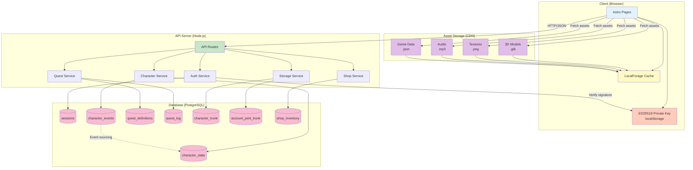

This diagram shows the high-level system architecture including client, server, database, and CDN components.

## Diagram

## Components

### Client (Browser)

**Astro Pages**:
- Server-side rendered pages with client-side hydration
- Uses Three.js for 3D rendering
- TypeScript for type safety

**LocalForage Cache**:
- IndexedDB wrapper for asset storage
- Key-value interface for easy access
- Stores 3D models, textures, audio, and game data
- Enables offline gameplay

**ED25519 Private Key**:
- Stored in localStorage
- Never sent to server
- Used for cryptographic authentication
- Generated on first visit

### API Server (Node.js)

**API Routes**:
- Express or similar framework
- RESTful JSON endpoints
- Session-based authentication
- Request/response validation with Zod

**Services**:

1. **Auth Service**:
   - Challenge-response authentication
   - ED25519 signature verification
   - Session management

2. **Character Service**:
   - Character CRUD operations
   - Event sourcing implementation
   - State projection from events

3. **Quest Service**:
   - Quest definitions and availability
   - Quest log management
   - Progress tracking

4. **Storage Service**:
   - Trunk (character-specific) operations
   - Joint Trunk (account-wide) operations
   - Item deposit/withdrawal

5. **Shop Service**:
   - Shop inventory management
   - Purchase/sell transactions
   - Price calculations

### Database (PostgreSQL)

**Core Tables**:

1. **sessions**: Active user sessions
2. **character_events**: Immutable event log (event sourcing)
3. **character_state**: Projected character state (derived from events)
4. **quest_definitions**: Static quest data
5. **quest_log**: Character quest progress
6. **character_trunk**: Character-specific storage
7. **account_joint_trunk**: Account-wide shared storage
8. **shop_inventory**: Available shop items

**Event Sourcing Pattern**:
- All character changes recorded as events
- `character_state` is a projection of `character_events`
- Enables audit trail and time travel debugging
- Allows recalculation of state if needed

### Asset Storage (CDN)

**Asset Types**:

1. **3D Models (.glb)**:
   - Character models
   - Weapon models
   - Enemy models
   - Environment assets

2. **Textures (.png)**:
   - Character skins
   - UI elements
   - Environment textures

3. **Audio (.mp3)**:
   - Background music
   - Sound effects
   - Voice clips

4. **Game Data (.json)**:
   - Quest definitions
   - Item definitions
   - Configuration files

**CDN Strategy**:
- Hash-based URLs for cache busting
- Long cache headers (immutable assets)
- Global distribution for low latency
- Compressed with gzip/brotli

## Data Flow

### Authentication Flow
1. Client generates/loads ED25519 key pair
2. Client sends public key to server
3. Server generates challenge nonce
4. Client signs nonce with private key
5. Server verifies signature
6. Server creates session

### Asset Loading Flow
1. Client fetches manifest from API
2. Client checks localForage cache
3. Client downloads missing assets from CDN
4. Client stores assets in localForage
5. Client validates asset hashes

### Character State Flow
1. Client requests character data
2. API server queries `character_state` projection
3. Server returns character data
4. Client action triggers state change
5. Server writes event to `character_events`
6. Server updates `character_state` projection
7. Server returns updated state to client

## Scalability Considerations

### Horizontal Scaling
- API servers are stateless (sessions in database)
- Can run multiple API server instances
- Load balancer distributes requests

### Caching Strategy
- CDN caches all static assets
- Client caches assets in localForage
- Database queries can be cached (Redis)
- Character state is cached client-side

### Database Optimization
- Indexes on frequently queried columns
- Event sourcing allows read replicas
- Partitioning for large tables (character_events)

## Security

### Client Security
- Private keys never leave client
- HTTPS for all connections
- Asset hash verification prevents tampering

### Server Security
- Signature verification for authentication
- Session token validation on all requests
- SQL injection prevention (parameterized queries)
- Rate limiting on API endpoints

### Database Security
- Encrypted connections
- Role-based access control
- Audit logging for sensitive operations

## Technology Stack

**Frontend**:
- Astro (SSR + SSG)
- TypeScript
- Three.js (3D rendering)
- LocalForage (IndexedDB)

**Backend**:
- Node.js
- Express or similar
- Zod (validation)
- TypeScript

**Database**:
- PostgreSQL
- Event sourcing pattern

**Infrastructure**:
- CDN (CloudFlare, AWS CloudFront, etc.)
- Docker containers
- CI/CD pipeline

## Related Documentation

- [User Flow](/architecture/user-flow) - User journey
- [API Contracts](/architecture/api-contracts) - API definitions
- [Data Flow](/architecture/data-flow) - Sequence diagrams
