This diagram shows the complete user flow from landing on the title screen through entering the city hub.

## Diagram

```mermaid
graph TD
    Start([Player visits /])

    Start --> CheckKey{Private key<br/>exists?}

    CheckKey -->|No| GenKey[Generate ED25519<br/>private key]
    CheckKey -->|Yes| LoadKey[Load private key<br/>from localStorage]

    GenKey --> Auth[Send public key<br/>to server]
    LoadKey --> Auth

    Auth --> Challenge[Server sends<br/>challenge nonce]
    Challenge --> Sign[Sign challenge<br/>with private key]
    Sign --> Verify[Server verifies<br/>signature]

    Verify --> Session[Create session]
    Session --> Sync[Redirect to /sync]

    Sync --> FetchManifest[GET /api/sync/manifest]
    FetchManifest --> CompareCache{Assets<br/>up to date?}

    CompareCache -->|No| DownloadAssets[Download missing/changed assets]
    CompareCache -->|Yes| ValidateCache[Validate cache]

    DownloadAssets --> StoreLocalForage[Store in localForage]
    StoreLocalForage --> ValidateCache

    ValidateCache --> CharSelect[Redirect to /character-select]

    CharSelect --> FetchChars[GET /api/characters?publicKey=xxx]
    FetchChars --> HasChars{Has<br/>characters?}

    HasChars -->|No| CharCreate[Redirect to /character-create]
    HasChars -->|Yes| ShowChars[Display character list]

    CharCreate --> SelectRace[Select race:<br/>Human/CAST/Newman]
    SelectRace --> SelectClass[Select class:<br/>14 options]
    SelectClass --> Customize[Customize appearance:<br/>colors, variation]
    Customize --> NameChar[Enter character name]
    NameChar --> CreateChar[POST /api/characters/create]
    CreateChar --> ShowChars

    ShowChars --> ClickChar[Click character]
    ClickChar --> ModeSelect[Redirect to /mode-select]

    ModeSelect --> ChooseMode{Choose mode}
    ChooseMode -->|Offline| SelectOffline[POST /api/city/enter]
    ChooseMode -->|Online| OnlineLobby[Online lobby<br/>future feature]

    SelectOffline --> City[Redirect to /city]

    City --> CityHub[Display city hub<br/>with services]

    style Start fill:#e1f5e1
    style City fill:#e1f5e1
    style Auth fill:#fff4e6
    style Sync fill:#fff4e6
    style CharSelect fill:#fff4e6
    style ModeSelect fill:#fff4e6
    style FetchManifest fill:#e3f2fd
    style FetchChars fill:#e3f2fd
    style CreateChar fill:#e3f2fd
    style SelectOffline fill:#e3f2fd
```

## Flow Breakdown

### Phase 1: Authentication
1. Player visits `/` (Title Screen)
2. Check for existing ED25519 private key in localStorage
3. If not found, generate new key pair
4. Send public key to server
5. Server generates challenge nonce
6. Client signs challenge with private key
7. Server verifies signature
8. Server creates session

### Phase 2: Asset Synchronization
1. Redirect to `/sync`
2. Fetch asset manifest from server
3. Compare with localForage cache
4. Download missing/outdated assets
5. Store assets in localForage with hash verification
6. Validate all required assets are present

### Phase 3: Character Selection
1. Redirect to `/character-select`
2. Fetch characters for current account (by publicKey)
3. If no characters exist, redirect to character creation
4. Display character list with stats
5. Player clicks a character

### Phase 4: Character Creation (if needed)
1. Select race (Human, CAST, Newman)
2. Select class (14 classes based on race)
3. Customize appearance (colors, variation, hair, shade)
4. Enter character name
5. POST to create character
6. Return to character select with new character

### Phase 5: Mode Selection
1. Redirect to `/mode-select`
2. Display Offline/Online options
3. Player selects mode (Offline for now)
4. POST to enter city

### Phase 6: City Entry
1. Redirect to `/city`
2. Load city state (active quests, notifications, etc.)
3. Display city hub with available services

## Decision Points

The diagram highlights several critical decision points:

- **Private Key Check**: Determines if authentication is needed
- **Asset Cache Check**: Determines if downloads are needed
- **Character Existence**: Routes to creation or selection
- **Mode Choice**: Routes to offline or online gameplay

## API Calls

API calls made during this flow:

1. `POST /api/auth/challenge` - Get authentication challenge
2. `POST /api/auth/verify` - Verify signature and create session
3. `GET /api/sync/manifest` - Get asset manifest
4. `GET /assets/*` - Download individual assets
5. `GET /api/characters` - Fetch character list
6. `POST /api/characters/create` - Create new character (if needed)
7. `POST /api/city/enter` - Enter city hub

## Related Documentation

- [Title Screen](/screens/title-screen) - Authentication details
- [Sync Screen](/screens/sync) - Asset synchronization
- [Character Select](/screens/character-select) - Character management
- [Character Create](/screens/character-create) - Character creation flow
- [Mode Select](/screens/mode-select) - Mode selection
- [City](/screens/city) - City hub overview
